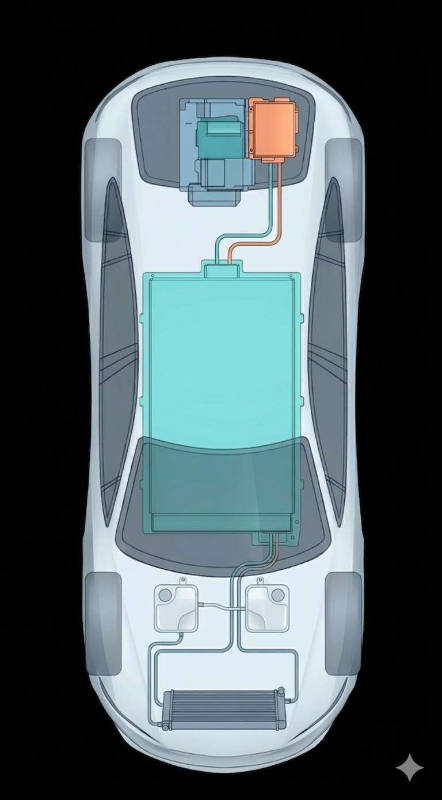
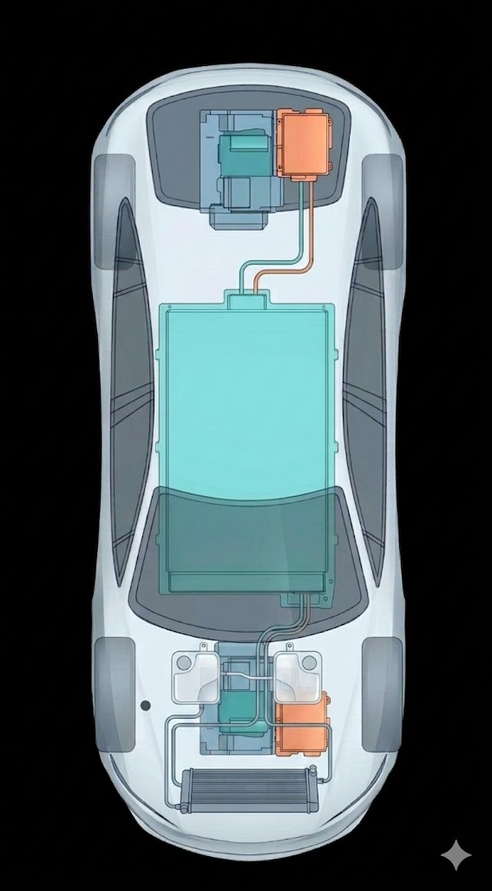
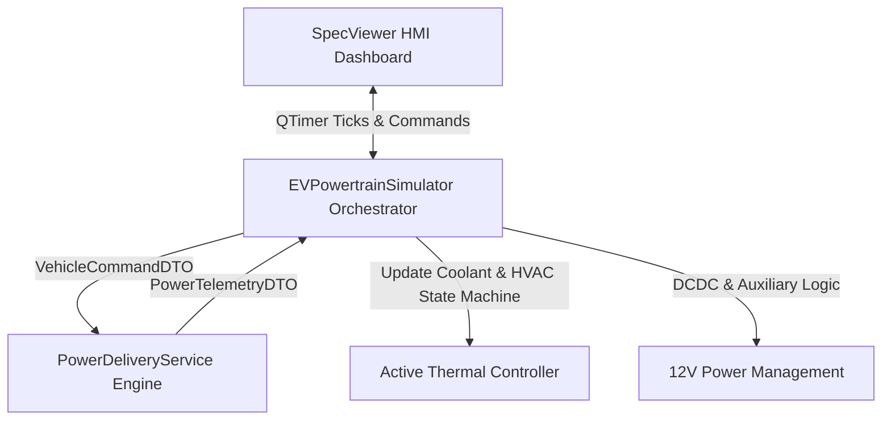

# ⚡ Alpha EV Powertrain Simulation Engine & Dashboard

A high-fidelity, real-time electric vehicle (EV) powertrain simulation engine and telemetry dashboard. This project models the physics, vehicle dynamics, electrical flows, and thermal behavior of the **Alpha EV Prototype** notches-back sedan. 

It contains both a C++/Qt6 production core telemetry dashboard and a Python research prototype.

---

## 📸 Interface Preview & Schemes

Below are the top-down configuration layouts for the RWD and AWD system models:

| RWD Configuration | AWD Configuration |
| :---: | :---: |
|  |  |

---

## ⚙️ System Features & Physics Specification

The simulation engine complies with the [Executive Master Specification v3.0](specs/master_specification_v3.0.md) (local spec file: [master_specification_v3.0.md](file:///Users/mba23/projects/powertrain/specs/master_specification_v3.0.md)):

1. **Propulsion Modalities (RWD & AWD):**
   * **RWD Modality:** Rear Propulsion Unit (RDU) powered by a Silicon Carbide (SiC) MOSFET Permanent Magnet Synchronous Motor (PMSM) producing up to **3,600 Nm peak wheel torque** with an 18,000 RPM ceiling.
   * **AWD Modality:** Adds a front-axle AC Induction Motor (ACIM) producing **1,200 Nm of on-demand peak torque**.
2. **Advanced Vehicle Dynamics & Control:**
   * **Virtual Slip Control (VSC) & Torque Vectoring:** Capping rear axle torque dynamically based on normal force, road slope, and surface type ($\mu$). Excess torque demands are instantly routed to the front axle (AWD).
   * **Power Limit Slew-Rate:** Prevents transient shock on the drivetrain by limiting power transients using a rate-limiting algorithm (`smoothLimit`).
   * **Slip-Protected Regenerative Braking:** Integrates a blending controller that limits negative regen torque based on dynamic wheel-grip levels to prevent lockups.
3. **Double-Loop Liquid Thermal Management:**
   * **Powertrain Loop (PT):** Circulates glycol through the motors and inverters with high/med/low pump speeds, dynamic ram-air radiator heat transfer ($0.06 \cdot v^2$), and active loop heaters (2.0 kW) / chillers (1.5 kW).
   * **Battery Loop (Bat):** Dedicated coolant loop with HVAC chiller-assisted cooling (1.0 kW) and heater (3.0 kW) governed by a hysteresis thermostat.
   * **Thermal Derating & Safety Limp-modes:** Escolates cooling pump speeds dynamically. Drops power to **70% derate** under normal thermal ceilings, and triggers an **Emergency 20% Limp Mode** (or 0% cut when stationary) if critical safety thresholds are exceeded.
4. **12V Low Voltage DC-DC Converter:**
   * Simulates auxiliary loads (computers, headlights, high-beams, infotainment compute).
   * Managed via an active hysteresis controller that triggers HV battery recharge loops when the 12V system SOC drops below 80%.

---

## 🏛️ System Architecture

The C++ production engine is built following a **Service-Oriented Architecture (SOA)**:



* **Orchestrator (`EVPowertrainSimulator`):** Coordinates simulation ticks, thermal pre-checks, active safety states, and auxiliary control loops.
* **Math Engine (`PowerDeliveryService`):** Pure-math physics service estimating resistances, power limits, traction constraints, and torque blends.
* **Data Transfer Objects (`vehicle_dto.h`):** Decoupled structures (`VehicleCommandDTO`, `PowerTelemetryDTO`, `ThermalTelemetryDTO`) representing strict communication interfaces.

---

## 🛠️ Build and Installation

### 💻 C++/Qt6 Production Application (Recommended)

The C++ build uses **CMake** to generate compilation files and links against **Qt6** (Widgets/SVG) and **spdlog** (High-Performance Logging).

#### 1. Prerequisites (macOS via Homebrew)
Make sure you have CMake, Qt6, and spdlog installed on your local environment:
```bash
brew install cmake qt spdlog
```

#### 2. Run Build Script
The workspace includes a build script that validates dependencies, configures CMake, and compiles the source code in parallel using all available CPU cores:
```bash
# Grant execution permissions
chmod +x build.sh

# Build the project
./build.sh
```

#### 3. Run the Dashboard
Execute the generated binary to launch the application:
```bash
./qt/build/EVSimulationQt
```

---

### 🐍 Python Research Prototype

The Python implementation contains a simplified single-threaded replica of the physics and thermodynamics engine wrapped in a Tkinter GUI.

#### Prerequisites
Ensure Python 3 is installed along with the PIL/Pillow dependency:
```bash
pip install Pillow
```

#### Run the Prototype
```bash
python python/ev_simulation.py
```

---

## 📁 Repository Structure

```
├── build.sh                  # Shell build orchestrator script
├── README.md                 # Project README documentation
├── app_icon.jpg              # Application icon
├── qt/                       # Production C++ Source Directory
│   ├── CMakeLists.txt        # CMake configuration build file
│   ├── main.cpp              # Entry point & global dark theme setup
│   ├── specviewer.h/cpp      # Main dashboard HMI window
│   ├── powertrain_simulator  # Orchestrator & state machine
│   ├── power_service.h/cpp   # Dynamics & Traction Math Engine
│   ├── powergraph.h/cpp      # Live graphics & rolling chart engine
│   ├── vehicle_dto.h         # Strict DTO telemetry interfaces
│   └── assets.qrc            # Qt Asset configuration file
├── python/                   # Python research code
│   └── ev_simulation.py      # Tkinter GUI simulation prototype
└── specs/                    # Specifications folder
    └── master_specification_v3.0.md   # Executive physics & system specification
```
